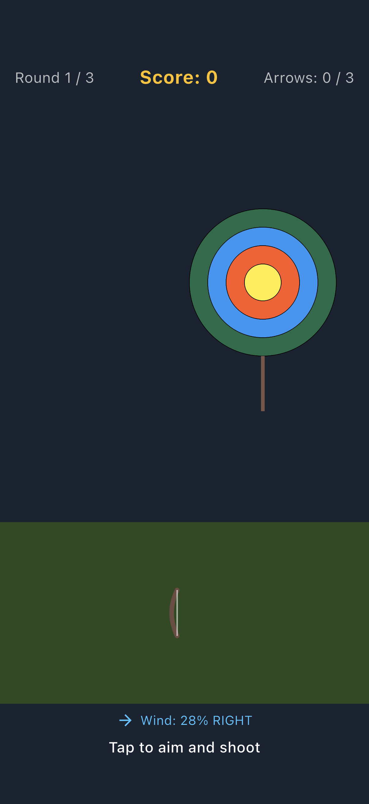
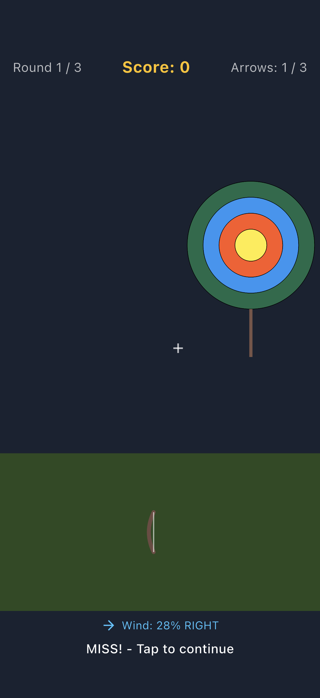
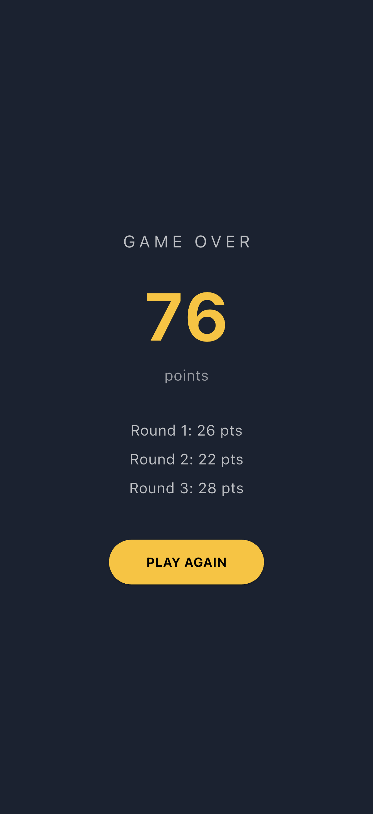

# Flutter Archery Game

A Flutter archery game built with Riverpod. Tap to aim and loose arrows at a moving target while compensating for shifting wind, across 3 rounds of 3 arrows each, with per-round and cumulative scoring. Rendering is fully custom: the target, bow, arrow arc, and hit markers are drawn with a `CustomPainter`, and the game loop runs on an always-on animation ticker that advances the arrow physics and the moving target every frame.

## Demo

Real iOS-Simulator captures from the running app (not mockups), generated via an integration-test driver. See [FLOW.md](FLOW.md) for how they were produced.

| Aiming | Arrow / scoring | Result |
| --- | --- | --- |
|  |  |  |

## Features

- Tap-to-aim shooting with a parabolic arrow arc drawn frame by frame.
- Wind mechanics: a per-arrow wind strength and direction drift the arrow mid-flight.
- Moving target that bounces across the field, so timing matters.
- Scoring zones (bullseye 10, inner 8, 6, hit 4, miss 0) with hit labels.
- 3 rounds x 3 arrows with per-round and cumulative score tracking.
- Game-over result screen with a round-by-round breakdown and replay.

## Stack

- Flutter (Material 3, dark theme)
- Riverpod (`NotifierProvider`) for game state
- `CustomPainter` for the target, bow, arrow, and hit-marker rendering
- `integration_test` for real on-device screenshot capture
